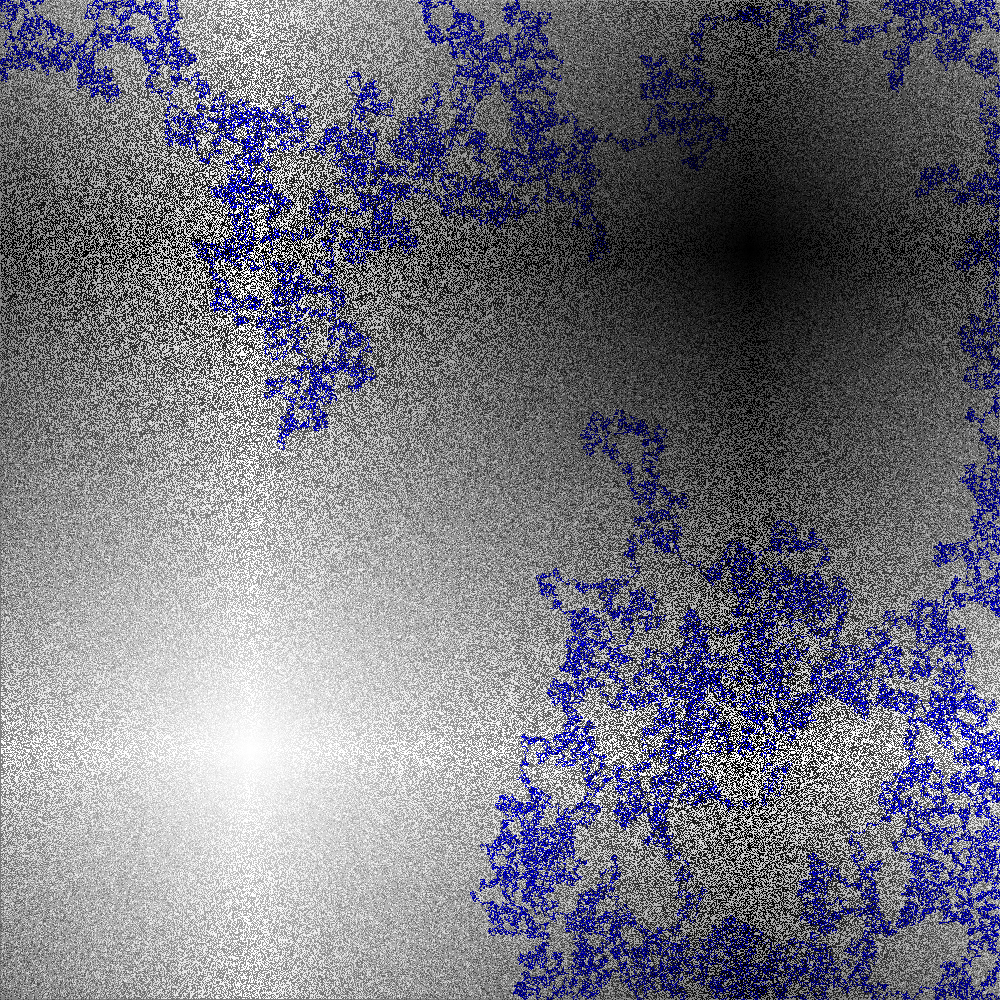

This program Solves mazes

pathFinder works in two steps.

1. An algorithm that hugs the wall left. View "result.png"

2. An algorithm that cleans up all of the dead ends in the maze. View "simplified.png"

This works only on mazes with no openings (If you are in the maze you shouldnt be able to get out).

The start and the end of the maze is distinguished with two distinct colors.

maze 4000x4000 px 

